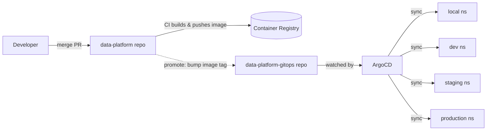

# data-platform-gitops

GitOps configuration repository for the **Enterprise Data Intelligence Platform**. ArgoCD
watches this repo and continuously reconciles the desired state into each environment's
Kubernetes namespace.

## How it works



- The **Helm chart** lives in the app repo (`deploy/helm/data-platform`).
- This repo holds the **ArgoCD `Application`/`ApplicationSet` manifests** and the
  **per-environment value overrides** (image tags, replica counts) under `environments/`.
- ArgoCD uses a **multi-source** Application: chart + base values from the app repo, plus
  the env override file from this repo.

## Layout

```
bootstrap/
  root-app.yaml          # App-of-Apps: ArgoCD watches apps/ in this repo
apps/
  applicationset.yaml    # generates one Application per environment
environments/
  local/values.yaml      # image tag + env-specific overrides
  dev/values.yaml
  staging/values.yaml
  production/values.yaml
```

## Setup

```bash
# 1. Install ArgoCD in the cluster
kubectl create namespace argocd
kubectl apply -n argocd -f https://raw.githubusercontent.com/argoproj/argo-cd/stable/manifests/install.yaml

# 2. Point ArgoCD at this repo (edit repoURLs first to your forks)
kubectl apply -f bootstrap/root-app.yaml
```

## Promotion & rollback

- **Promote** dev -> staging -> production by bumping `imageTag` in the target
  environment's `environments/<env>/values.yaml` via PR. ArgoCD auto-syncs on merge.
- **Rollback** with `git revert` of the offending commit (ArgoCD reconciles back), or via
  `argocd app rollback data-platform-<env> <history-id>`.
